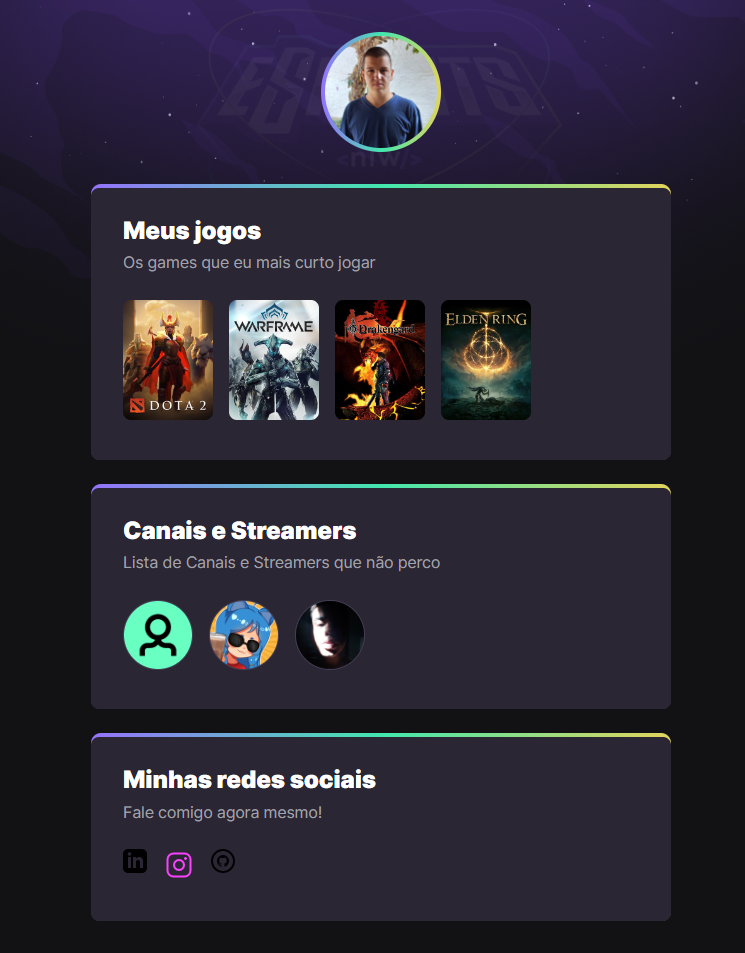

# NLW eSports 

>Trilha Explorer🚀🚀

Projeto construído dentro do programa Next Level Week da Rocketseat.

[🔗Clique aqui para acessar](https://lmoreira-dev.github.io/NLW-E-sports-explorer/)
## Tecnologias 💻

- HTML
- CSS
- Git e Github

## 📚 Aprendizados 📚

Esse evento abordou além das questões de programação e dos diversos usos do HTML,CSS, Git e Github, o mesmo também propôs diversos ensinamentos sobre lógica de programação e pensamento analítico. 

## 🧡📧 Contato

- Instagram: [@lucas.moreiratr](https://www.instagram.com/lucas.moreiratr/)
- Github: [LMoreira-Dev](https://github.com/LMoreira-Dev)
- E-mail: lucasmoreirateixeiraribeiro@gmail.com
